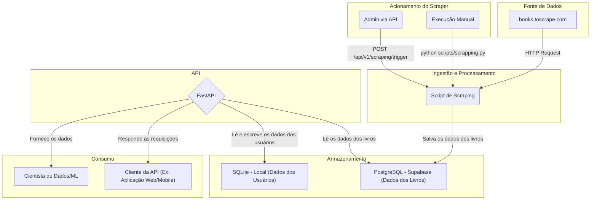

# Plano Arquitetural

Este documento detalha a arquitetura do projeto, o pipeline de dados, os planos de escalabilidade e a integração com modelos de Machine Learning.

## 1. Diagrama de Arquitetura

## 2. Pipeline de Dados: Ingestão → Processamento → API → Consumo

O pipeline de dados é o fluxo que os dados percorrem desde a sua origem até o consumidor final.

1.  **Ingestão:**
    *   **Fonte de Dados:** O site `books.toscrape.com`.
    *   **Mecanismo:** Um script Python (`scripts/scrapping.py`) utiliza as bibliotecas `requests` e `BeautifulSoup` para fazer a varredura (scraping) do site.
    *   **Trigger:** O processo de ingestão pode ser acionado de duas formas:
        *   Manualmente, executando o script `scripts/scrapping.py`.
        *   Através da API, pelo endpoint `POST /api/v1/scraping/trigger` (requer autenticação de administrador).

2.  **Processamento e Armazenamento:**
    *   **Processamento:** O script de scraping processa o HTML extraído, limpando e estruturando os dados dos livros (título, preço, categoria, etc.) em um formato tabular.
    *   **Armazenamento:** Os dados processados são armazenados em um banco de dados PostgreSQL hospedado no Supabase. A cada nova execução, a tabela de livros é substituída para garantir que os dados estejam sempre atualizados.

3.  **Exposição (API):**
    *   **Tecnologia:** A API RESTful, desenvolvida com FastAPI, atua como a camada de acesso aos dados.
    *   **Funcionalidades:** A API oferece endpoints para consulta, busca e listagem dos dados dos livros. Ela também gerencia a autenticação de usuários, que são armazenados em um banco de dados SQLite separado.

4.  **Consumo:**
    *   **Usuários Finais:** A API pode ser consumida por qualquer aplicação cliente (web, mobile, etc.) que necessite de dados do catálogo de livros.
    *   **Cientistas de Dados:** Os dados podem ser consumidos para análise, exploração e treinamento de modelos de Machine Learning.

## 3. Arquitetura para Escalabilidade Futura

A arquitetura atual foi projetada com a escalabilidade em mente.

*   **API (FastAPI):** O FastAPI é um framework assíncrono de alta performance, capaz de lidar com um grande número de requisições concorrentes. Para escalar a API, podemos:
    *   **Escalabilidade Vertical:** Aumentar os recursos (CPU, memória) do servidor onde a API está hospedada.
    *   **Escalabilidade Horizontal:** Utilizar um orquestrador de contêineres como Kubernetes para replicar a API em múltiplos `pods`, com um `load balancer` para distribuir o tráfego.

*   **Banco de Dados (Supabase):** O Supabase é uma plataforma `serverless` que escala automaticamente com o uso. Caso o volume de dados cresça exponencialmente, podemos migrar para uma instância de PostgreSQL dedicada com replicação e `sharding`.

*   **Scraper:** O processo de scraping pode ser desacoplado e executado em um ambiente `serverless` (ex: AWS Lambda, Google Cloud Functions) em intervalos regulares, garantindo a atualização contínua dos dados sem sobrecarregar a API.

## 4. Cenário de Uso para Cientistas de Dados/ML

Os dados coletados podem ser de grande valor para cientistas de dados e engenheiros de Machine Learning.

*   **Análise Exploratória de Dados (EDA):** Os cientistas de dados podem consumir a API para obter os dados e realizar análises, como:
    *   Distribuição de preços dos livros.
    *   Categorias mais populares.
    *   Correlação entre preço e avaliação.

*   **Fonte de Dados para Modelos de ML:** Os dados podem ser utilizados como `features` para treinar diversos tipos de modelos de Machine Learning.

## 5. Plano de Integração com Modelos de ML

A arquitetura atual pode ser estendida para integrar modelos de Machine Learning.

1.  **Modelo de Recomendação:**
    *   **Objetivo:** Criar um sistema de recomendação de livros para os usuários.
    *   **Desenvolvimento:**
        1.  Utilizar os dados de livros (categoria, preço, avaliação) para treinar um modelo de recomendação (ex: filtragem colaborativa ou baseada em conteúdo).
        2.  O modelo pode ser treinado em um ambiente separado (ex: Jupyter Notebook, Databricks).
    *   **Integração:**
        1.  O modelo treinado pode ser salvo e carregado na API.
        2.  Criar um novo endpoint na API, como `/api/v1/books/recommendations/{user_id}`, que retorna uma lista de livros recomendados para um determinado usuário.

2.  **Modelo de Precificação Dinâmica:**
    *   **Objetivo:** Prever o preço de um livro com base em suas características.
    *   **Desenvolvimento:**
        1.  Treinar um modelo de regressão (ex: Regressão Linear, XGBoost) utilizando `features` como categoria, avaliação e disponibilidade.
    *   **Integração:**
        1.  Criar um endpoint `/api/v1/books/predict_price` que recebe as características de um livro e retorna uma estimativa de preço.

3.  **Processamento de Linguagem Natural (NLP):**
    *   **Objetivo:** Analisar as descrições dos livros para extrair tópicos ou sentimentos.
    *   **Desenvolvimento:**
        1.  Utilizar modelos de NLP (ex: LDA para extração de tópicos, ou um modelo de análise de sentimentos pré-treinado) para processar as descrições dos livros.
    *   **Integração:**
        1.  Os resultados da análise de NLP podem ser adicionados como novas colunas na tabela de livros (ex: `topics`, `sentiment`).
        2.  A API pode ser atualizada para permitir a busca de livros por tópicos ou sentimentos.
