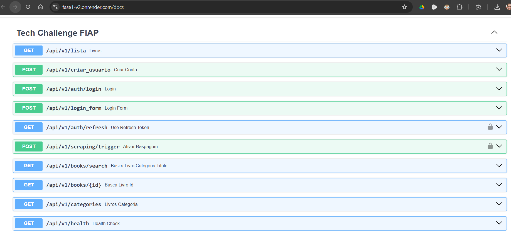

# Tech Challenge 1 - Pós Tech - 7MLET - Grupo 59 

## Integrantes:

- BARBARA CRISTINA SILVA CAMPOS
  - babiih.font@gmail.com
  
- GABRIEL CAETANO GUIMARAES DE MELLO
  - mellogcg@gmail.com
  
- GEREMIAS FRANCISCO DE OLIVEIRA SANTOS
  - geremias_cte@hotmail.com
  
- MURILLO CARVALHO
  - murillomg71@gmail.com
  
- WAGNER ULISSES FONTALVA
  - wagner.ulisses@gmail.com

## Descrição do Projeto e Arquitetura

Este projeto consiste em uma API de catálogo de livros, desenvolvida como parte do Tech Challenge da FIAP. A aplicação utiliza uma arquitetura baseada em microserviços, com um serviço de scraping para coleta de dados e uma API para exposição desses dados.

A arquitetura do projeto é composta por:

- **Web Scraper**: Um script Python que utiliza as bibliotecas `BeautifulSoup` e `requests` para extrair dados de livros do site [books.toscrape.com](http://books.toscrape.com). Os dados coletados são então armazenados no banco de dados principal.
- **Banco de Dados Principal (Supabase)**: Um banco de dados PostgreSQL hospedado na plataforma Supabase, que armazena todas as informações dos livros coletadas pelo scraper.
- **API (FastAPI)**: Uma API RESTful desenvolvida com FastAPI que expõe os dados dos livros. A API também gerencia a autenticação e autorização de usuários.
- **Banco de Dados da API (SQLite)**: Um banco de dados SQLite local, utilizado para gerenciar as informações dos usuários da API, como nomes, e-mails e senhas.
- **Gerenciamento de Dependências (UV)**: O projeto utiliza `uv` para gerenciar as dependências e o ambiente virtual Python.
- **Deploy (Render)**: A aplicação está disponível publicamente através do deploy na plataforma Render.

A documentação interativa da API (Swagger UI) está disponível em: [https://fase1-v2.onrender.com/docs](https://fase1-v2.onrender.com/docs)

## Instruções de Instalação e Configuração

Siga as instruções abaixo para configurar e executar o projeto em seu ambiente local.

### Pré-requisitos

- Python 3.12 ou superior
- [uv](https://github.com/astral-sh/uv) instalado

### Passos para Instalação

1.  **Clone o repositório:**
    ```bash
    git clone <url-do-repositorio>
    cd <nome-do-repositorio>
    ```

2.  **Utilize a função Sync do UV para criar um ambiente virtual Python e instalar as dependências:**
    ```bash
    uv sync
    ```

3.  **Configure as variáveis de ambiente:**
    Crie um arquivo `.env` na raiz do projeto e adicione as seguintes variáveis. Substitua os valores de exemplo pelos seus.

    ```env
    # Configuração do Banco de Dados (Supabase)
    USER="seu-usuario"
    PASSWORD="sua-senha"
    HOST="seu-host"
    PORT="sua-porta"
    DBNAME="seu-banco-de-dados"

    # Configuração da API (JWT)
    SECRET_KEY="sua-chave-secreta"
    ALGORITHM="HS256"
    ACCESS_TOKEN_EXPIRE_MINUTES=30
    ```

## Documentação das Rotas da API

A seguir, a documentação das principais rotas da API.



### Autenticação

-   **`POST /api/v1/criar_usuario`**
    -   **Descrição:** Cria um novo usuário no sistema.
    -   **Autenticação:** Não requerida.

-   **`POST /api/v1/auth/login`**
    -   **Descrição:** Autentica um usuário e retorna um token de acesso e um refresh token.
    -   **Autenticação:** Não requerida.

-   **`GET /api/v1/auth/refresh`**
    -   **Descrição:** Gera um novo token de acesso a partir de um refresh token válido.
    -   **Autenticação:** Requer token de acesso.

### Livros

-   **`GET /api/v1/lista`**
    -   **Descrição:** Retorna uma lista de todos os livros disponíveis.
    -   **Autenticação:** Não requerida.

-   **`GET /api/v1/books/search`**
    -   **Descrição:** Busca por livros com base no título e/ou categoria.
    -   **Parâmetros de Query:** `title` (string), `category` (string).
    -   **Autenticação:** Não requerida.

-   **`GET /api/v1/books/{id}`**
    -   **Descrição:** Retorna os detalhes de um livro específico pelo seu ID.
    -   **Autenticação:** Não requerida.

-   **`GET /api/v1/categories`**
    -   **Descrição:** Retorna uma lista de todas as categorias de livros disponíveis.
    -   **Autenticação:** Não requerida.

### Scraping

-   **`POST /api/v1/scraping/trigger`**
    -   **Descrição:** Dispara o processo de web scraping para atualizar o banco de dados com novos livros.
    -   **Autenticação:** Requerida (apenas para usuários administradores).

### Health Check

-   **`GET /api/v1/health`**
    -   **Descrição:** Verifica o status da API e a conexão com o banco de dados.
    -   **Autenticação:** Não requerida.

## Exemplos de Chamadas com Requests/Responses

### Criar um Usuário

**Request:**
```bash
curl -X POST "https://fase1-v2.onrender.com/api/v1/criar_usuario" -H "Content-Type: application/json" -d '{
  "nome": "Teste",
  "email": "teste@example.com",
  "senha": "123",
  "admin": false
}'
```

**Response:**
```json
{
  "mensagem": "User cadastrado com sucesso"
}
```

### Login de Usuário

**Request:**
```bash
curl -X POST "https://fase1-v2.onrender.com/api/v1/auth/login" -H "Content-Type: application/json" -d '{
  "email": "teste@example.com",
  "senha": "123"
}'
```

**Response:**
```json
{
  "access_token": "seu-access-token",
  "refresh_token": "seu-refresh-token",
  "token_type": "Bearer"
}
```

### Listar todos os Livros

**Request:**
```bash
curl -X GET "https://fase1-v2.onrender.com/api/v1/lista"
```

**Response:**
```json
[
  {
    "id": 1,
    "title": "A Light in the Attic",
    "price": 51.77,
    "rating": 3,
    "availability": 22,
    "category": "Poetry",
    "image_url": "https://fase1-v2.onrender.com/media/cache/2c/da/2cdad67c44b002e7ead0cc35693c0e8b.jpg",
    "description": "It's hard to imagine a world without A Light in the Attic. This now-classic collection of poetry and drawings from Shel Silverstein seems to have been around forever...",
    "upc": "a897fe39b1053632",
    "product_type": "Books",
    "number_of_reviews": 0,
    "currency": "£"
  }
]
```

### Buscar por um Livro

**Request:**
```bash
curl -X GET "https://fase1-v2.onrender.com/api/v1/books/search?title=Attic"
```

**Response:**
```json
{
  "id": 1,
  "title": "A Light in the Attic",
  "price": 51.77,
  "rating": 3,
  "availability": 22,
  "category": "Poetry",
  "image_url": "https://fase1-v2.onrender.com/media/cache/2c/da/2cdad67c44b002e7ead0cc35693c0e8b.jpg",
  "description": "It's hard to imagine a world without A Light in the Attic. This now-classic collection of poetry and drawings from Shel Silverstein seems to have been around forever...",
  "upc": "a897fe39b1053632",
  "product_type": "Books",
  "number_of_reviews": 0,
  "currency": "£"
}
```

## Plano Arquitetural

Para mais detalhes sobre a arquitetura do projeto, consulte o [Plano Arquitetural](ARCHITECTURE.md).

## Instruções para Execução

### Executando a API

Para iniciar o servidor da API localmente, execute o seguinte comando na raiz do projeto:

```bash
ur run uvicorn api.main:app --reload
```

A API estará disponível em `http://127.0.0.1:8000`.

### Executando o Web Scraper

Para executar o script de web scraping manualmente e popular o banco de dados, execute o seguinte comando:

```bash
uv run scripts/scrapping.py
```
